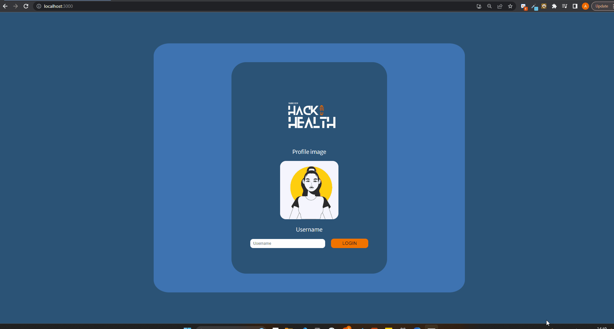

# HackHealth

###### April 2023

An MVP built in React that helps you to keep track of your daily steps and your weekly step goal.

## Screenshots

## Motivation

As a team, we were tasked with solving an issue for someone participating in a coding bootcamp. After some research, we found it was quite common that bootcampers were not getting as much exercise as they were previously. We ran with that idea and settled on building an app that would allow a user to track their steps and compete with other bootcampers. Of course, this would be a very ambitious project to code in two days so we settled on an MVP that would allow a user to set their weekly goal and track their daily steps.

## Lessons Learned

- At the initial stages of the project, we had some big goals that turned out to be more ambitious than we initially anticipated, and required a lot more effort than we had originally planned for. However, we were able to adapt and reevaluate our approach multiple times, which allowed us to prioritise the most essential features for the minimum viable product (MVP), given the time constraints we faced.

- Taking the time to read documentation/watch videos before trying to implement something new e.g. Using React router.

- We all felt that perhaps given this brief, we could have individually created an MVP a lot sooner but that as a team, it may have taken longer but we created a much better product.

- Taking our time to read other team members code and understand what it was doing. We found that when we went to make changes or add further functionality to something someone else had written, it was better to really take our time and understand instead of charging in and assuming we knew what we were doing. We found that once we did understand, it was then easier to add code that worked.

## Tech Stack

**Client:** React (version 18.2.0), JavaScript, HTML, CSS

## Installation and Setup Instructions

You will need `node` and `npm` installed on your machine.

Clone the repo:

`https://github.com/SchoolOfCode/bc14_w7_project-frontend-room1-ash-anjum-david-tom`

Install the required npm modules:

`npm install`

Start the application:

`npm start`

## Improvements

- Displaying data visually in the form of barcharts to give the user a quick and easy way to understand their data.
- Allowing a user to select a profile picture or upload their own.
- Add rewards for step milestones acheived
- Allow users to add friends and compete with other users

## Usage

1. Enter a user name and press enter on keyboard or the login button
2. Enter your weekly step goal and press enter on keyboard or submit button
3. The app loads with the current day. Enter the steps you have done for that day and press enter on keyboard or the enter button.
4. Use the navigation bar on the left hand side to select other days and see what you entered for them.
5. Press the check here button to compare how well you have done comapred to your weekly goal
6. You can also see the distance you have covered in kilometers on the right.
